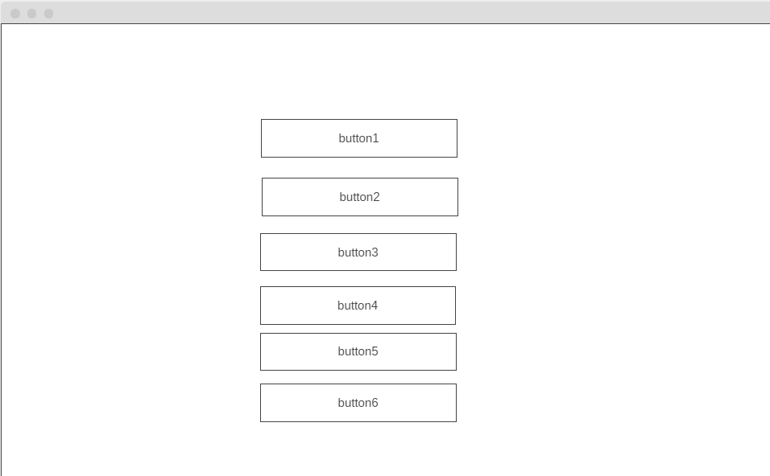

## Development Strategy

  

>  **Debugging-project**

  

write a short description of your project:

- the project is aim is to build simple website with buttons using JS, HTML and CSS.
The project will be developed in a small group by using branches and project board on GitHub.

  

## Wireframe

  

<!-- include a wireframe for your project in this repository, and display it here -->

<!-- wireframe.cc is a good site for getting started with wireframes -->

  

## 0. Set-Up

  *assigned to Kateryna*

  

__A User can see my initial repository and live demo__

  

### Repo

  

 - Generate repository from [debugging-project-week-1](https://github.com/HackYourFutureBelgium/debugging-project-week-1)

 - Write initial, basic README

 - Start Development Stratedy
 - Create wireframe
 - Create project board 
 - Assign issues according to agreed dev strategy
 - Turn on GitHub Pages

  

## 1. intro

 *assigned to Kateryna*
  *reviewed by Hazem*
  

### Repository

- [x] developed on a branch called `intro`

### HTML

- [x] created buttons in HTML
- [x] title
- [x] meta's
- [x] links to css and js files

### CSS

- [x] added CSS on buttons

### JS
- [x] n/a

  

## 2. Two buttons

*assigned to Hazem*
*reviewed by Ismail*
  

__full user story description__

  

### Repo

  

- [X] developed on a branch called `top`
  

 - [X] created buttons in HTML

 - [X] links to css and js files

  - [X] styled buttons css

  - [X] write the formula in Java.sc folder
  - [X] write readme file

  
## 3. Two middle buttons

*assigned to Ismail*
*reviewed by Kateryna*

- developed on a branch called `middle`
  

### HTML
- assigned class for "two middle buttons"

### CSS
- styled buttons 

### JS

- wrote the formula in Java.sc folder 

## 4. Two last buttons

- developed on a branch called `bottom`

*assigned to Kateryna*
*reviewed by Hazem*
  

### HTML
- [] has been added previsouly  

 

### CSS
- [] styled buttons, added hover, nice nackground, buttons have been created by using flexboxes

### JS

- [] added fuctions and const values, set user alert 

  

## Finishing Touches

  

- Write final, complete README:

-  [makeareadme.com](https://www.makeareadme.com/)

-  [bulldogjob](https://bulldogjob.com/news/449-how-to-write-a-good-readme-for-your-github-project)

-  [meakaakka](https://medium.com/@meakaakka/a-beginners-guide-to-writing-a-kickass-readme-7ac01da88ab3)

- Validate code to check for any last mistakes
